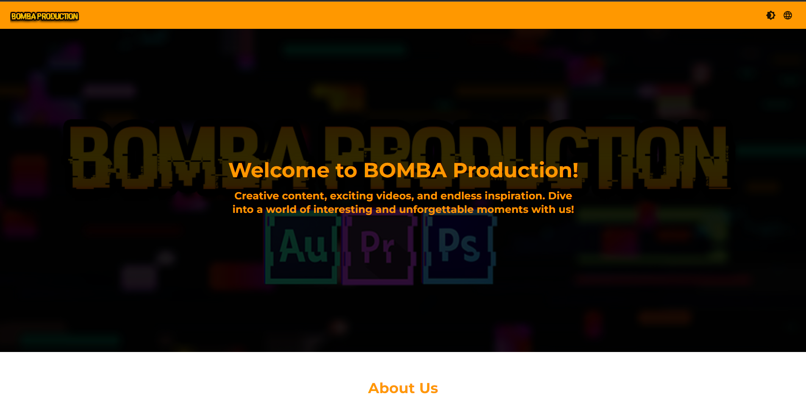
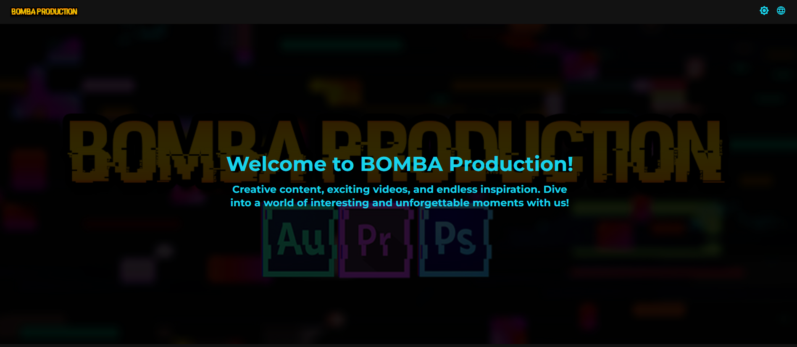
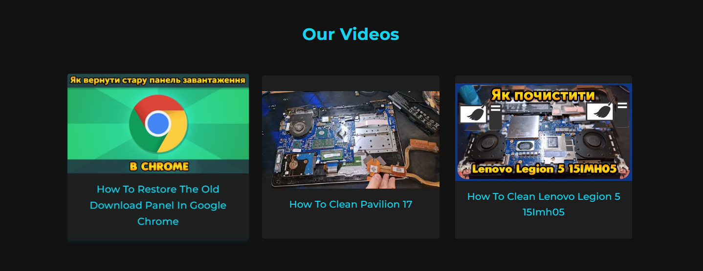
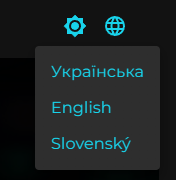

# 📓 Testing Landing Page for My YouTube Channel

<p align="center" width="200%">
    
</p>

 

Welcome to my first React project! This is a landing page designed for my YouTube channel, and it serves as a test of my skills. The project is built using React and styled with Material-UI.

## 🌟 Features

- 🎨 **Dark and Light Mode:** Users can toggle between a dark and light theme.
- 🎥 **Latest Video Display:** Embeds and displays the latest video from my YouTube channel.
- 📱 **Responsive Design:** Fully responsive and adapts to any screen size.
- 🌍 **Multilingual Support:** Supports multiple languages including English, Ukrainian, and Slovak.

## 🖥️ Screenshots

### Light Mode


### Dark Mode


### Video Display


### Language Switcher


## 🚀 Getting Started

Follow these steps to get the project running locally.

### Prerequisites

- **Node.js** (v14 or higher)
- **npm** (v6 or higher) or **yarn** (v1 or higher)

### Installation

1. **Clone the repo:**
   ```bash
   git clone https://github.com/Antot-12/Testing-landingpage-for-my-YouTube-chanell.git
   cd Testing-landingpage-for-my-YouTube-chanell


## 🤝 Contributing

Contributions, issues, and feature requests are welcome!

1. Fork the project
2. Create your feature branch (`git checkout -b feature/new-feature`)
3. Commit your changes (`git commit -m 'Add some feature'`)
4. Push to the branch (`git push origin feature/new-feature`)
5. Open a Pull Request


## 🙏 Acknowledgements

- [React Documentation](https://reactjs.org/docs/getting-started.html) for excellent resources and tutorials.
- [Material-UI](https://mui.com/) for providing a great set of components.
- [YouTube API](https://developers.google.com/youtube/v3) for enabling the video fetching functionality.

