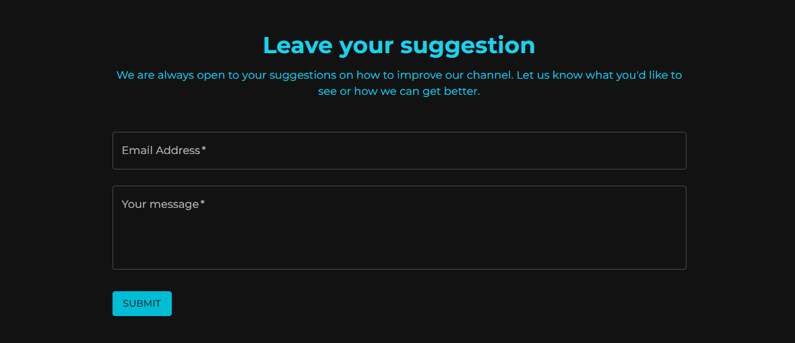

# 📓 Testing Landing Page for My YouTube Channel

<p align="center" width="200%">
    
</p>

 

Welcome to my first React project! This is a landing page designed for my YouTube channel, and it serves as a test of my skills. The project is built using React and styled with Material-UI.

## 🌟 Features

- 🎨 **Dark and Light Mode:** Users can toggle between a dark and light theme.
- 🎥 **Latest Video Display:** Embeds and displays the latest video from my YouTube channel.
- 📱 **Responsive Design:** Fully responsive and adapts to any screen size.
- 🌍 **Multilingual Support:** Supports multiple languages including English, Ukrainian, and Slovak.

## 🖥️ Screenshots

### Light Mode


### Dark Mode


### Video Display


### Language Switcher
<p align="center">
    
</p>


## 💌 Suggestion Form

<p align="center">
    
</p>

Our landing page includes a suggestion form that allows viewers to send their ideas and feedback directly to my email. This form is an easy way for you to share your thoughts on how we can improve the content and overall experience of the channel.

### Key Features:
- **User-Friendly Interface:** Simple and intuitive design for ease of use.
- **Direct Communication:** Submissions are sent straight to my inbox, ensuring I receive your feedback promptly.
- **Privacy Assurance:** Your email and message are handled with the utmost confidentiality.

Feel free to share your suggestions on how we can enhance the channel!


## 🗂️ Project Structure

```plaintext
my-youtube-channel/
│
├── node_modules/          # Dependencies
├── public/                # Publicly accessible files
│   ├── index.html         # Main HTML file
│   ├── logo.png           # Project logo
│   └── ...                # Other assets
│
├── src/                   # Source files
│   ├── assets/            # Image assets
│   │   ├── image-3.jpg
│   │   ├── logo.png
│   │   └── react.svg
│   │
│   ├── components/        # React components
│   │   ├── AboutSection.jsx
│   │   ├── ArticlePage.jsx
│   │   ├── Footer.jsx
│   │   ├── HeroSection.jsx
│   │   ├── LanguageSelector.jsx
│   │   ├── LatestVideo.jsx
│   │   ├── Navbar.jsx
│   │   ├── SuggestionForm.jsx
│   │   ├── VideoGallery.jsx
│   │   └── VideoSection.jsx
│   │
│   ├── App.css            # Global styles
│   ├── App.jsx            # Main React component
│   ├── index.css          # Additional styles
│   ├── main.jsx           # Entry point
│   └── ...                # Other files
│
├── youtube-landing-page/   # Additional project (optional)
│   ├── .idea/             # IDE settings
│   ├── .gitignore         # Files to ignore by Git
│   ├── README.md          # Project README
│   ├── package.json       # Project metadata and dependencies
│   └── ...                # Other files
│
├── .gitignore              # Files to ignore by Git
├── vite.config.ts          # Vite configuration
└── ...                    # Other files


```


## 🚀 Getting Started

Follow these steps to get the project running locally.

### Prerequisites

- **Node.js** (v14 or higher)
- **npm** (v6 or higher) or **yarn** (v1 or higher)

### Installation

1. **Clone the repo:**
   ```bash
   git clone https://github.com/Antot-12/Testing-landingpage-for-my-YouTube-chanell.git
   cd Testing-landingpage-for-my-YouTube-chanell


## 🤝 Contributing

Contributions, issues, and feature requests are welcome!

1. Fork the project
2. Create your feature branch (`git checkout -b feature/new-feature`)
3. Commit your changes (`git commit -m 'Add some feature'`)
4. Push to the branch (`git push origin feature/new-feature`)
5. Open a Pull Request


## 🙏 Acknowledgements

- [React Documentation](https://reactjs.org/docs/getting-started.html) for excellent resources and tutorials.
- [Material-UI](https://mui.com/) for providing a great set of components.
- [YouTube API](https://developers.google.com/youtube/v3) for enabling the video fetching functionality.

